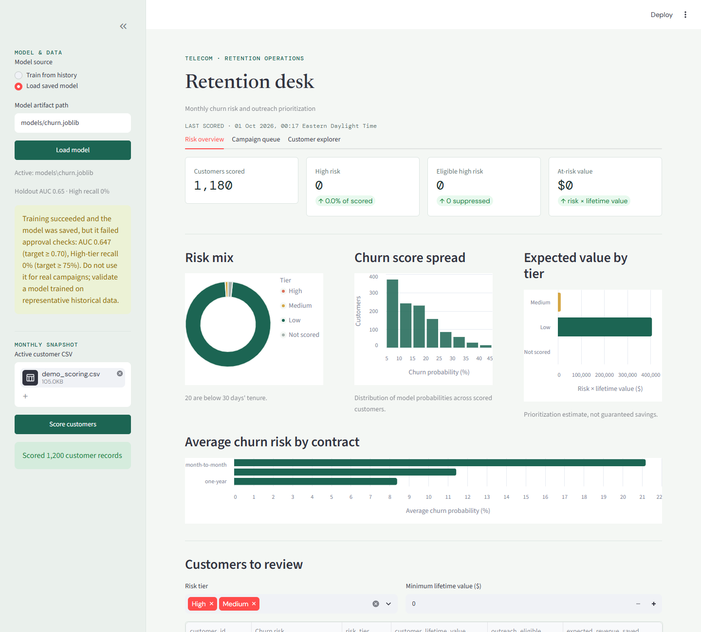

# Telecom Churn Prediction

A Python starter project for identifying telecom customers at risk of cancelling within 60 days. It trains a stacked ensemble of Random Forest, XGBoost, and Logistic Regression models, assigns risk tiers, calculates customer-level SHAP explanations, and prepares budget-ranked retention task exports.

> **Demo data only:** This repository does not include real customer or warehouse data. The included generator produces synthetic examples so you can run the workflow. Demo model scores are not production evidence and must not be used to make customer outreach decisions.

## Features

- Stacked churn classifier and holdout AUC / High-tier recall reporting.
- Risk tiers: High (`>= 0.70`), Medium (`0.40` to `< 0.70`), and Low (`< 0.40`).
- Minimum-tenure rule: customers under 30 days are not scored.
- Protected demographic fields are excluded from model features.
- SHAP-based top drivers, calculated by default for CLI scoring and on demand in the dashboard.
- Outreach suppression for marketing opt-outs and customers with an offer in the previous 90 days.
- Expected-value ranking using churn probability multiplied by customer lifetime value.
- Streamlit analyst dashboard with graphical risk summaries, filters, customer explanations, and CSV exports.

## Requirements

- Windows PowerShell instructions are shown below; Python 3.10 or later is required.
- Git is only needed if you plan to publish the project to GitHub.

## Quick Start

Run these commands from the project folder:

```powershell
py -m venv .venv
.\.venv\Scripts\Activate.ps1
python -m pip install --upgrade pip
python -m pip install -e ".[dev]"
```

Generate synthetic training and scoring CSVs:

```powershell
python scripts/make_demo_data.py --output data/demo_customers.csv
Import-Csv data/demo_customers.csv |
    Select-Object * -ExcludeProperty churn_60d |
    Export-Csv data/demo_scoring.csv -NoTypeInformation
```

Train, then score the separate unlabeled snapshot:

```powershell
churn-model train --input data/demo_customers.csv --model models/churn.joblib
churn-model score --input data/demo_scoring.csv --model models/churn.joblib --output outputs/scores.csv --top-n 60
```

Training saves the model at `models/churn.joblib`. The CLI exits with code `2` and prints an alert if holdout AUC is below `0.70` or High-tier recall is below `0.75`. This is an approval warning, not necessarily a training failure. The synthetic data may fail these targets.

## Dashboard

### Demo Screenshot

The screenshot below shows the dashboard populated with synthetic demo data. Its model metrics are illustrative only and are not approved for customer outreach.



Start the local dashboard:

```powershell
streamlit run app/dashboard.py
```

Open the local URL printed by Streamlit. In the sidebar:

1. Choose **Train from history** and upload `data/demo_customers.csv`, or choose **Load saved model** to load `models/churn.joblib`.
2. Upload `data/demo_scoring.csv` under **Active customer CSV**.
3. Select **Score customers**.

The dashboard provides a risk overview with tier mix, churn-score distribution, estimated value by tier, and average churn risk by contract. The campaign queue ranks eligible High-tier customers under a monthly budget cap. The customer explorer calculates SHAP drivers for a selected customer. Score and CRM task tables can be downloaded as CSV files.

Use `demo_customers.csv` for **training** because it contains the `churn_60d` outcome. Use `demo_scoring.csv` for **scoring** because it intentionally has no outcome label. The dashboard reports a clear message if the unlabeled scoring file is mistakenly selected for training.

## CSV Data Contract

Training data must contain:

| Column | Description |
| --- | --- |
| `customer_id` | Unique customer identifier |
| `tenure_days` | Customer tenure at the historical snapshot |
| `churn_60d` | Whether the customer churned within 60 days of that snapshot; accepts binary or common yes/no labels |

At least 10 examples of each outcome must remain after applying the 30-day tenure rule. For useful training, provide multiple historical snapshots and a correctly observed 60-day outcome.

Scoring data must contain `customer_id`, `tenure_days`, `customer_lifetime_value`, and every model feature used at training time. Useful feature examples include `contract_type`, `monthly_charges`, `previous_monthly_charges`, `support_calls_90d`, and usage aggregates. `monthly_charge_change` is derived when both current and previous monthly charges are present.

Optional scoring columns:

| Column | Purpose |
| --- | --- |
| `marketing_opt_out` | Excludes opted-out customers from outreach tasks, but not scoring |
| `last_offer_date` | Suppresses outreach if a retention offer was sent within 90 days |

Identifiers, labels/outcomes, customer lifetime value, opt-out status, offer dates, and detected protected demographic columns are not used as model features. Review the protected-column denylist against your organization’s compliance requirements before deployment.

## Validation and Tests

Run the test suite:

```powershell
python -m pytest -q
```

The holdout metrics are a basic development check. The current training implementation uses a stratified random split; production approval should use a time-separated holdout, representative data, and agreed monitoring thresholds. Recall/AUC do not establish campaign lift or ROI; use a controlled campaign experiment to measure those outcomes.

## Outputs

- `models/churn.joblib`: trained model artifact.
- `outputs/scores.csv`: customer scores, tiers, drivers, eligibility, and expected-value estimates.
- `outputs/scores_crm_tasks.csv`: eligible High-tier CRM task candidates, ranked by expected value.

The dashboard’s download buttons save files through the browser rather than automatically writing them to `outputs/`. The CLI writes its outputs to the paths passed on the command line. CRM, warehouse, dashboard hosting, alerting, and campaign outcome integrations are not included in this local starter project.

## Publish to GitHub

Generated customer CSVs, trained model artifacts, and output files are ignored by `.gitignore`. Do not commit real customer data, model artifacts containing sensitive information, credentials, or warehouse exports.

Create an empty GitHub repository, then from this project folder run:

```powershell
git init
git add .
git status
git commit -m "Add telecom churn prediction starter"
git branch -M main
git remote add origin https://github.com/<your-user>/<your-repository>.git
git push -u origin main
```

Replace the remote URL with your repository URL. Review `git status` before committing to confirm no private data or generated artifacts are staged.
